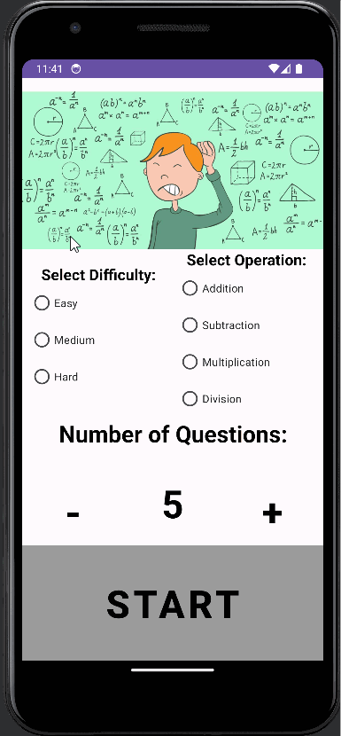

# Arithmetic Game Project

An app that lets a user choose their difficulty and what operation they want to practice. Asks how many questions they want to do, then gives them questions.

## Functionality 

The following **required** functionality is completed:

* [ ] User can choose a difficulty.
* [ ] User can choose what operation to practice.
* [ ] User can choose how many questions they want.
* [ ] User can choose to play again after endin the game.

The following **extensions** are implemented:

* If no difficulty is selected, automatically gives user the hardest difficulty.
* If no operation is selected, automatically gives user the hardest operation in my opinion, division.

## Video Walkthrough

Here's a walkthrough of implemented user stories:

GIF created with [LiceCap](http://www.cockos.com/licecap/).

## Notes

Final score is not operational. It will tell a user the total questions a user answered at the end, but can not tell how many questions a user got correct.

## License

    Copyright [2023] [Tristan Dearborn]

    Licensed under the Apache License, Version 2.0 (the "License");
    you may not use this file except in compliance with the License.
    You may obtain a copy of the License at

        http://www.apache.org/licenses/LICENSE-2.0

    Unless required by applicable law or agreed to in writing, software
    distributed under the License is distributed on an "AS IS" BASIS,
    WITHOUT WARRANTIES OR CONDITIONS OF ANY KIND, either express or implied.
    See the License for the specific language governing permissions and
    limitations under the License.
